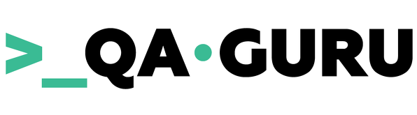
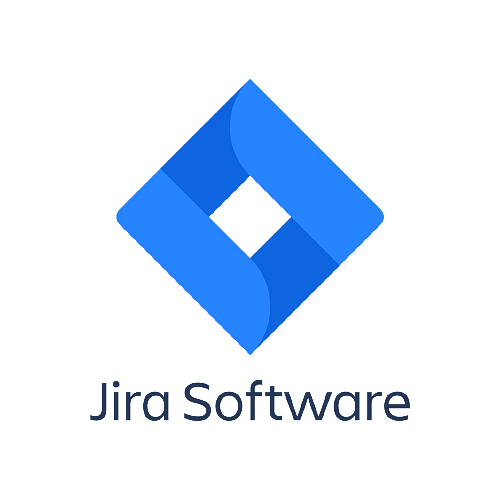

   <h1>
      Hi there!:wave:
   </h1>

<!--About me-->

## :technologist:About me
- I'm manual and automation Engineer from Chelyabinsk.
- I work QA about 2 years.
- I write autotests in Python
- Email: surovp08@gmail.com
- Contacts:

  &#8287;&#8287;&#8287;&#8287;&#8287;
  
  &#8287;
  
  &#8287;
   
  &#8287;
  

<!--Education-->

## :man_student:Education
<table width="100%" border='0'>
   <tr> 
    <td width="30%" valign="bottom"></td><td valign="middle">South Ural State University. Institute of Large and Exact Sciences. Faculty of Mathematics, Mechanics and Computer Technologies.</td></tr>
  </table>
   
  
  #### Additional Education:
<table width="100%" border='0'>
   <tr><td width="30%" valign="bottom"></td><td valign="middle">Programming school Python <a target="_blank" href="https://shultais.education/lms/courses">shultais school</a>.</td></tr>
   
   <tr><td width="30%" valign="bottom"></td><td valign="middle">School of Test Automation Engineers <a target="_blank" href="https://qa.guru">qa.guru</a>.</td></tr>
   </tr>
  </table>
  
  
  
<!--Stack and tools-->

&#8287;&#8287;&#8287;&#8287;&#8287;
## :computer:Stack and tools

  <code></code>
  <code></code>
  <code></code>
  <code></code>
  <code></code>
  <code></code>
  <code></code>
  <code></code>
  <code></code>
  <code></code>
  <code></code>
  <code></code>
  <code></code>
  <code></code>
  <code></code>
  <code></code>
  <code></code>
  <code></code>
  <code></code>
  <code></code>
  <code></code>
  <code></code>
  <code></code>

  
  
<!--Projects-->

## :floppy_disk:Projects
### UI autotests
#####  [DemoQa](https://github.com/surovp/qa_guru_python_2_pageobjects)

&#8287;&#8287;&#8287;&#8287;&#8287;
### API autotests
#####  [Reqres](https://github.com/surovp/API_reqres)
#####  [ApiDm](https://github.com/surovp/dm_api_tests_pavels)

&#8287;&#8287;&#8287;&#8287;&#8287;
### Mobile autotests
#####  [Wikipedia](https://github.com/surovp/Mobile_Wiki)

<!--Git Stats-->

&#8287;&#8287;&#8287;&#8287;&#8287;
## :bar_chart:Git stats

 

